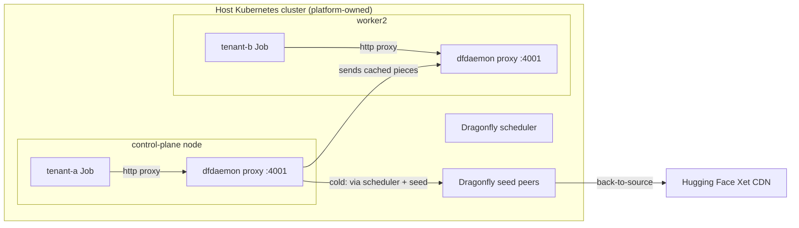

# One Model, Many Tenants: Running Dragonfly as a Shared P2P Model Cache Under vCluster

## Result status

This repository documents one complete, reproducible run. Two tenants on separate
vCluster API servers requested the same pinned public Hugging Face model artifact
through a platform-owned Dragonfly deployment.

- tenant-a (cold, on the control-plane node): the scheduler assigned the seed
  peer as the source, so Dragonfly fetched the model once and served tenant-a
  from it.
- tenant-b (second run, on a different worker): received the model pieces from a
  remote Dragonfly peer under the same Dragonfly task id, with no origin fetch in
  its window.
- Both tenants received an identical SHA-256 checksum.

The captured logs prove remote-peer participation for the second tenant. This run
did not independently measure total origin bytes or exclude every possible origin
request. See [evidence/processed/results.md](evidence/processed/results.md) for the
classified result and the exact log lines.

Note on scope: each Job also sends a small HEAD request to huggingface.co to
resolve the file's CDN URL. The experiment concerns delivery of the 267954768
byte model payload through Dragonfly, not elimination of every request to
Hugging Face.

## What this lab tests

When two tenants use separate vCluster API servers on one Kubernetes platform
and request the same pinned public Hugging Face model artifact, can a
platform-owned Dragonfly deployment serve the second tenant from a peer instead
of downloading the payload from the origin again, without giving the tenant
workload node-level privileges?

## Validation scope

- One two-tenant run on a disposable local kind cluster.
- Open source vCluster only.
- Dragonfly HTTP proxy path.
- No GPU, private or gated models, NetworkPolicy, eviction, cache pressure,
  failure injection, or hostile-tenant testing.
- Wall-clock time is recorded as an observation, not a benchmark.

## Architecture



- The host cluster runs Dragonfly: schedulers, seed peers, and a client
  (dfdaemon) DaemonSet. This chart runs in manager-less mode.
- The client DaemonSet uses hostNetwork and exposes an HTTP proxy on port 4001 on
  every node.
- Two open source vClusters, tenant-a and tenant-b, each have their own API
  server and kube context.
- Each tenant runs the same Kubernetes Job. The Job resolves the model file URL,
  rewrites the returned CDN URL from https to http, and pulls it through the
  node-local Dragonfly proxy (found via the downward-API host IP). The Job has no
  hostPath, hostNetwork, hostPID, hostIPC, or privileged container.

## Platform and tenant ownership

- The platform owns the host nodes, the Dragonfly components, and the cache.
- A tenant sees only its own vCluster API server and runs an ordinary Job.
- The tenant does not configure Dragonfly and receives no node-level privileges.
- This lab does not test isolation against a hostile tenant, so it makes no
  security claim about that.

## Prerequisites

- A disposable host cluster you control (this run used kind).
- kubectl, helm, and the vcluster CLI.
- Outbound access to Hugging Face from the cluster.

## Tested versions

See [versions.env](versions.env). In the recorded run:

- kind v0.34.0-alpha, node image kindest/node:v1.37.0, Kubernetes v1.37.0 (host)
- kubectl v1.37.1, helm v3.22.0, docker 29.8.1
- Dragonfly chart 1.8.5, app 2.5.2, client image v1.5.5
- vcluster CLI 0.37.2, tenant API server v1.36.0
- Model: distilbert-base-uncased, revision 12040accade4e8a0f71eabdb258fecc2e7e948be,
  file model.safetensors (267954768 bytes), served from the Hugging Face Xet CDN
- Job image: curlimages/curl:8.22.0

## Host cluster

```bash
kind create cluster --config kind/kind-config.yaml --wait 5m
export HOST_CONTEXT=kind-dragonfly-host
kubectl get nodes -o wide
```

## Dragonfly setup

Install Dragonfly on the host cluster only, pinned to the tested chart version,
using [dragonfly/values.yaml](dragonfly/values.yaml) (which sets the seed peer
count to two workers and the Xet proxy rule):

```bash
helm repo add dragonfly https://dragonflyoss.github.io/helm-charts/
helm repo update
helm install dragonfly dragonfly/dragonfly \
  --version 1.8.5 \
  --namespace dragonfly-system --create-namespace --wait --timeout 10m \
  -f dragonfly/values.yaml
```

The values file strips the signed Xet query parameters so the same content path
yields a stable cache key. It was tested only with a public model that needs no
token. Do not apply that rule to private or gated URLs without validating
authorization and cross-tenant access first.

Confirm the components are healthy (see
[evidence/raw/host-components.txt](evidence/raw/host-components.txt)):

```bash
kubectl -n dragonfly-system get statefulset,daemonset,pods -o wide
```

The client DaemonSet pods have IPs equal to their node IPs, which confirms
hostNetwork.

## Creation of tenant-a and tenant-b

```bash
vcluster create tenant-a -n tenant-a -f vclusters/tenant-a.yaml --connect=false
vcluster create tenant-b -n tenant-b -f vclusters/tenant-b.yaml --connect=false
vcluster connect tenant-a -n tenant-a --background-proxy
vcluster connect tenant-b -n tenant-b --background-proxy
kubectl config get-contexts -o name | grep vcluster
```

The vcluster CLI version (0.37.2) determines the tenant chart it installs. To pin
the chart explicitly, record the installed chart version and pass
`--chart-version <version>` to `vcluster create`.

Each context reaches its own API server (see
[evidence/raw/tenant-contexts.txt](evidence/raw/tenant-contexts.txt)). The tenant
API server ran v1.36.0 while the host ran v1.37.0.

## Tenant Job manifest

Both tenants apply the same manifest,
[workloads/model-pull-job.yaml](workloads/model-pull-job.yaml). The run scripts
create a ConfigMap named model-pull-config with the model coordinates and the
proxy port, substitute the image, and apply the Job. The Job runs as a non-root
user with all capabilities dropped and no host namespaces.

## Run tenant-a

The cold run. Copy `versions.env.example` to `versions.env`, fill it in, then:

```bash
scripts/run-tenant-a.sh
```

Result (see [evidence/raw/tenant-a-run.txt](evidence/raw/tenant-a-run.txt)):
the Job ran on the control-plane node, pulled 267954768 bytes through the proxy,
and printed SHA-256 `5e3f1108...f0063`.

## Run tenant-b

The second run, on a different worker so any reuse crosses nodes. In the recorded
run the control-plane was cordoned to place tenant-b on a worker, then uncordoned:

```bash
kubectl cordon <control-plane-node>
scripts/run-tenant-b.sh
kubectl uncordon <control-plane-node>
```

Result (see [evidence/raw/tenant-b-run.txt](evidence/raw/tenant-b-run.txt)):
the Job ran on dragonfly-host-worker2, received the same 267954768 bytes, and
printed the same SHA-256.

## Verify the transfer source

Read the Dragonfly client logs:

```bash
kubectl -n dragonfly-system logs -l app=dragonfly,component=client --all-containers --prefix \
  | grep -iE 'task|source|parent|peer|sent'
```

In the recorded run
([evidence/raw/tenant-a-dfdaemon.log](evidence/raw/tenant-a-dfdaemon.log),
[evidence/raw/tenant-b-dfdaemon.log](evidence/raw/tenant-b-dfdaemon.log)):

- Both tenants used the same task_id
  `c8dca2997b92a8a1c371703fb29ab83a2148a18213ed830f1c4fb944d53eb5d7`.
- tenant-a's source was the seed peer.
- tenant-b's parents were the control-plane client and the seed peer; it
  collected all 64 pieces from them, and the control-plane client logged sending
  its cached pieces to tenant-b's node.

## Verify checksums

Both tenants printed:

```
5e3f1108e3cb34ee048634875d8482665b65ac713291a7e32396fb18f6ff0063
```

## Observed result

Remote-peer delivery. The second tenant, on a different host worker, received the
model pieces from a Dragonfly peer under the same task id, and received a
byte-identical artifact.

## What the result means

- A platform-owned Dragonfly deployment can serve a second vCluster tenant from
  the P2P network under a shared task id, instead of that tenant fetching the
  payload from the origin.
- The tenant workload needs no node-level privileges to use it.

## What the result does not mean

- It is not a performance benchmark. The timings are single observations.
- It does not measure total origin bytes or exclude every origin request.
- It does not show behavior under cache eviction, cache pressure, or node failure.
- It does not test GPUs, private or gated models, or NetworkPolicy.
- It does not establish isolation against a hostile tenant.

## Alternatives

A platform team could instead use a per-node registry mirror or pull-through
cache, or a shared PVC cache mounted into tenant workloads. This design was chosen
to test cross-tenant reuse while keeping cache ownership at the platform layer. It
is not presented as better than those options.

## Limitations

Single two-tenant run on a disposable kind cluster. No GPU, NetworkPolicy,
eviction, cache-pressure, private-model, failure-injection, or hostile-tenant
testing. The control-plane was cordoned only to place tenant-b on a different
worker, then uncordoned.

## Cleanup

```bash
vcluster delete tenant-a -n tenant-a
vcluster delete tenant-b -n tenant-b
helm uninstall dragonfly -n dragonfly-system
kind delete cluster --name dragonfly-host
```

## Evidence index

- [evidence/processed/results.md](evidence/processed/results.md): classified result and table
- [evidence/processed/run-manifest.yaml](evidence/processed/run-manifest.yaml): full run manifest
- [evidence/processed/tenant-a-applied-job.yaml](evidence/processed/tenant-a-applied-job.yaml): the Job as applied
- [evidence/raw/host-components.txt](evidence/raw/host-components.txt): Dragonfly components
- [evidence/raw/tenant-contexts.txt](evidence/raw/tenant-contexts.txt): tenant API separation
- [evidence/raw/tenant-a-run.txt](evidence/raw/tenant-a-run.txt), [evidence/raw/tenant-b-run.txt](evidence/raw/tenant-b-run.txt): Job runs
- [evidence/raw/tenant-a-dfdaemon.log](evidence/raw/tenant-a-dfdaemon.log), [evidence/raw/tenant-b-dfdaemon.log](evidence/raw/tenant-b-dfdaemon.log): transfer-source evidence

## References

- https://d7y.io/docs/next/operations/integrations/hugging-face/
- https://huggingface.co/blog/gaius-qi/hugging-face-distribution-based-on-dragonfly
- https://www.cncf.io/blog/2026/06/30/dragonfly-v2-5-0-is-released/
- https://www.cncf.io/blog/2026/04/06/peer-to-peer-acceleration-for-ai-model-distribution-with-dragonfly/

## Disclosure

Disclosure: the author is a member of the vCluster Ambassador Program. This
tutorial uses only open source vCluster features and was not reviewed or
sponsored by vCluster Labs.
